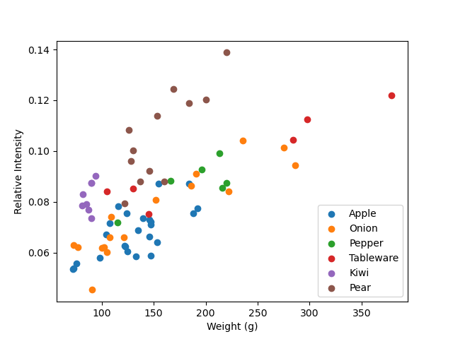

# Knockoff VibroScale

## Overview
 The Android app built for collecting vibrationd data is in the KnockoffVibroScale folder. Accelerometer data was collected on a Pixel 3 while the phone vibrated for a total of 8.5 seconds. For the first 3 seconds, the application displays "WAIT" indicating the item should not be placed down yet. After 3 seconds, "Place item" is shown. When the vibration ends, the accelerometer data is saved to the Downloads folder. 
 
 The DataProcessing folder contains the data and code used to  process the data and train the linear regression model. Data from the first 3 seconds is the pre-load data. Data from seconds 5-8 is used for the with-load data. The 2 seconds in between the pre-load and with-load data are discarded as this is when the item is being placed. In addition to the vibration changes due to the item being set down, the vibrations in this period are also sometimes unstable as the item wobbles and settles. The last half second is discarded to avoid any possible influence from removing the item. Relative intensity of items was calculated by subtracting the with-load intensity of the y-axis from the pre-load intensity of the y-axis. Model performance was evaluted with leave-one-object-out cross validation on the entire set of items, as well as on each item type.  

 The data is made up of 72 items. Apples, onions, peppers, and tableware were used in the original paper. The original counts were matched, although the weight ranges of the items differ. Additionally, 8 kiwis and 12 pears were included. Item weights were measured on a kitchen scale. 

## Results

|              | Apple | Onion | Pepper | Tableware | Kiwi | Pear  | All  | 
|--------------|-------|-------|--------|-----------|------|-------|------|
| Number (N)   |  24   |  16   |   6    |     6     |   8  |  12   |  72  | 
| Min/Max (g)  | 72/192| 73/286|115/220 |  105/379  |81/94 |122/220|72/379|
| MAE (g)      | 21.4  | 27.3  |  38.7  |    41.7   | 4.2  | 19.1  | 37.6 |
| MAPE (%)     | 17.8  | 20.7  |  24.2  |    27.3   | 4.8  | 12.3  | 26.8 | 

