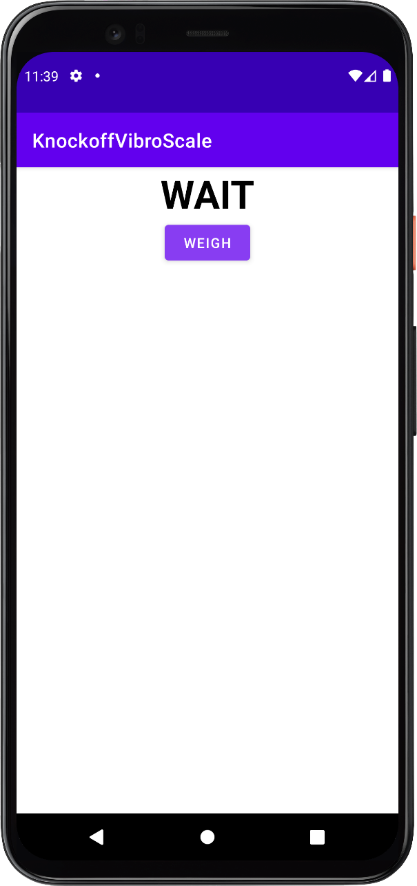
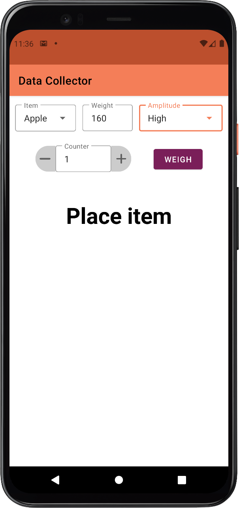
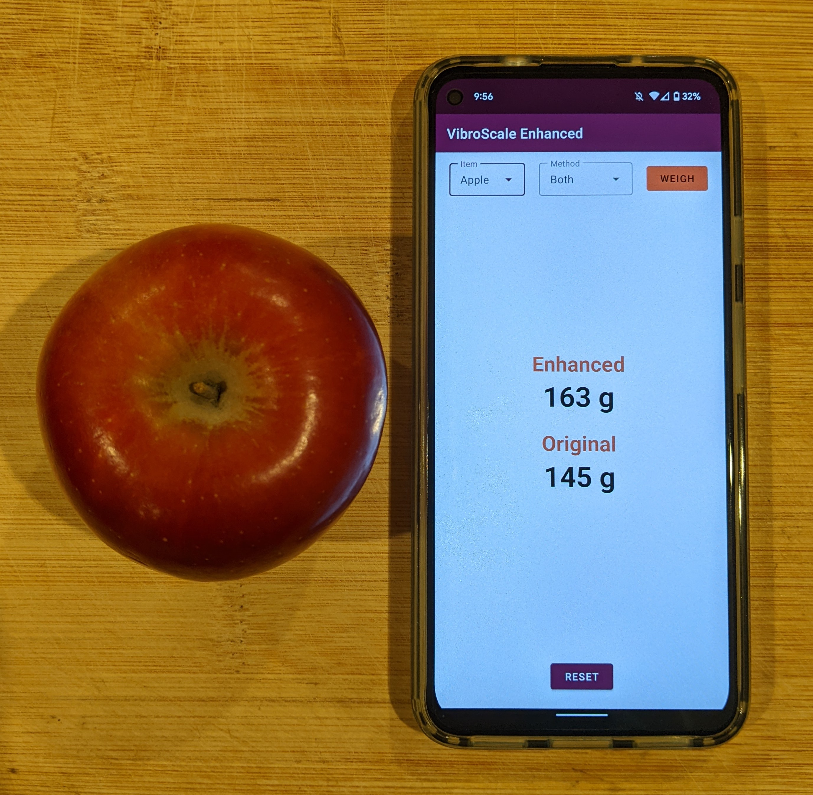

# Smartphone Scale (VibroScale Enhanced)

This was a group project for the graduate-level Georgia Tech class CS 7470: Mobile & Ubiquitous Computing. Originally inspired by the [2020 VibroScale paper](https://dl.acm.org/doi/10.1145/3410530.3414397) by Zhang et al., this project recreates the baseline approach and then extends it with improved data collection, feature engineering, and regularized regression models.

Initial data collection app |  Improved Data Collector app | VibroScale Enhanced (apple true weight 160g)
:-------------------------:|:-------------------------:|:-------------------------:
  |   | 

---

## Overview

- **Android apps** for accelerometer data collection and real-time predictions  
- **Flask backend API** to serve trained models  
- **Machine learning models** (Ridge, Lasso, ElasticNet) trained on custom datasets  
- **Dockerized deployment** to simplify hosting  

**My Contributions**:
- Built the initial Android app to collect accelerometer data before/after fruit placement. 
- Trained and evaluated the baseline regression model to reproduce the original VibroScale results.
- Developed the final prototype Android app and Flask backend for real-time predictions.
- Containerized the backend with Docker to resolve dependency issues during deployment.

**Team Contributions**
- Collected additional datasets (apples, pears, onions) across multiple devices.
- Enhanced signal processing and feature selection
- Experimented with regularized regression models (Ridge, Lasso, ElasticNet) to improve accuracy and generalization.

---

## Repo Structure

```
/API/                          # Flask backend 
/DataCollector/                # Android app for data collection
/modeling/                     # Datasets, ML training & evaluation scripts
/VibroScaleEnhanced/           # Final Android app
```

## Results

| Model / Features             | Apples (MAE g) | Onions (MAE g) | Pears (MAE g) | All (MAE g) |
|-------------------------------|----------------|----------------|---------------|-------------|
| Original Linear, Orig. Feat.  | 190.16         | 82.46          | 6.65          | 120.41      |
| Linear, Enhanced Features     | 80.93          | 47.41          | 10.98         | 69.01       |
| ElasticNet, Orig. Features    | 38.62          | 43.06          | 8.68          | 26.15       |
| ElasticNet, Enhanced Features | **37.80**      | **38.71**      | 8.68          | **24.34**   |

Regularization (ElasticNet) + enhanced features reduced MAE by over 50% compared to the baseline in most cases. Performance on pears remained relatively consistent across models due to dataset characteristics such as low weight variation.

---

## Future Work

- Collect larger, more diverse datasets.  
- Investigate cross-device calibration for robustness.  

---

## References

- Shibo Zhang, Qiuyang Xu, Sougata Sen, and Nabil Alshurafa. 2020. VibroScale: turning your smartphone into a weighing scale. In Adjunct Proceedings of the 2020 ACM International Joint Conference on Pervasive and Ubiquitous Computing and Proceedings of the 2020 ACM International Symposium on Wearable Computers (UbiComp/ISWC '20 Adjunct). Association for Computing Machinery, New York, NY, USA, 176–179. [https://doi.org/10.1145/3410530.3414397](https://doi.org/10.1145/3410530.3414397) 
- “What the Hack?” CS-7470 Team Report, Georgia Tech (2022)  

---

## Contributors (alphabetical)
- Sriram Bhat  
- Ben Frost  
- Cameron Redovian  
- Regina Wang  
